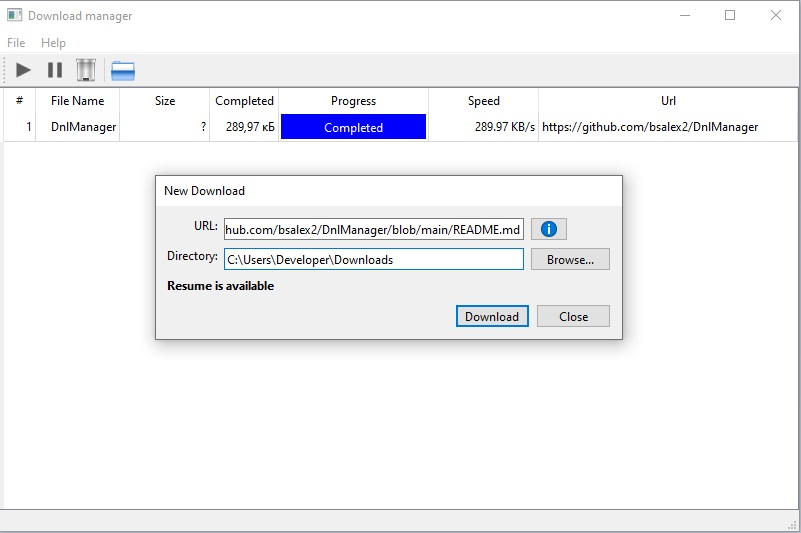

# DnlManager

DnlManager is a simple Download Manager written using Qt (6.4.2). 

## Features
- Supports HTTP & HTTPS targets
- Resumes download from existing file (if supported by the remote server)
- Drag & Drop functionality

## Build Instructions

- Install Qt6 (e.g., via MSYS2 or your preferred method).

- Open your terminal (e.g., MSYS2 shell).

- Run:

  qmake6

  make  
## License
GPLv2

## Requirements
- Qt 6.4.2 or later

## License
This project is licensed under the GPLv2 License. See the [LICENSE](LICENSE) file for details.